# Intramuros Tourism System - Use Case Diagram

## System Overview
The Intramuros Tourism System is a comprehensive Progressive Web Application (PWA) for managing tourism activities within Intramuros, Manila. The system supports three user roles: **Guest**, **Tourist (Registered User)**, and **Admin**.

---

## Use Case Diagram (PlantUML)

```plantuml
@startuml Intramuros_Tourism_System

left to right direction
skinparam packageStyle rectangle

actor Guest as G
actor "Tourist\n(Registered User)" as T
actor Administrator as A

rectangle "Intramuros Tourism System" {
  
  package "Authentication Module" {
    usecase "Register Account" as UC1
    usecase "Login with Email" as UC2
    usecase "Login with Google" as UC3
    usecase "Verify Email OTP" as UC4
    usecase "Reset Password" as UC5
    usecase "Send OTP" as UC5A
    usecase "Complete Profile" as UC6
  }
  
  package "Profile Management" {
    usecase "View Profile" as UC7
    usecase "Edit Profile Information" as UC8
    usecase "Update Profile Picture" as UC8A
    usecase "Change Password" as UC9
    usecase "Update Birthday" as UC8B
    usecase "Update Gender" as UC8C
    usecase "Update Country" as UC8D
    usecase "Change Language" as UC10
  }
  
  package "Itinerary Management" {
    usecase "Browse Itineraries" as UC11
    usecase "View Itinerary Details" as UC12
    usecase "Create Custom Itinerary" as UC13
    usecase "Upload Itinerary Image" as UC13A
    usecase "Select Sites" as UC13B
    usecase "Edit Itinerary" as UC14
    usecase "Delete Itinerary" as UC15
    usecase "Archive Itinerary" as UC16
    usecase "Start Tour" as UC17
    usecase "Navigate to Next Site" as UC18
    usecase "Mark Site as Visited" as UC19
  }
  
  package "Map & Navigation" {
    usecase "View 3D Map" as UC20
    usecase "View Site Pins" as UC21
    usecase "View Site Details" as UC22
    usecase "View Site Media" as UC22A
    usecase "Get Directions" as UC23
    usecase "View AR Content" as UC24
    usecase "Filter Sites" as UC25
  }
  
  package "Review System" {
    usecase "View Trip Archives" as UC26
    usecase "Write Review" as UC27
    usecase "Rate Site" as UC27A
    usecase "Upload Review Photos" as UC27B
    usecase "Edit Review" as UC28
    usecase "Delete Review" as UC29
  }
  
  package "Photobooth" {
    usecase "Access Photobooth" as UC30
    usecase "Capture Photo" as UC31
    usecase "Apply Filter" as UC32
    usecase "Apply Border" as UC33
    usecase "Download Photo" as UC34
    usecase "Share Photo" as UC35
  }
  
  package "AI Chatbot" {
    usecase "Ask Question" as UC36
    usecase "Get Tourist Info" as UC37
    usecase "Get Directions Help" as UC38
    usecase "Switch Language" as UC39
  }
  
  package "Emergency Services" {
    usecase "View Emergency Contacts" as UC40
    usecase "Call Emergency Number" as UC41
  }
  
  package "Admin - User Management" {
    usecase "View All Users" as UC42
    usecase "Search Users" as UC42A
    usecase "Change User Role" as UC43
    usecase "Delete User" as UC44
    usecase "View User Logs" as UC45
  }
  
  package "Admin - Site Management" {
    usecase "Manage Sites" as UC46
    usecase "Add New Site" as UC47
    usecase "Upload Site Media" as UC47A
    usecase "Set AR Content" as UC47B
    usecase "Edit Site" as UC48
    usecase "Delete Site" as UC49
    usecase "Set Site Status" as UC50
    usecase "Set Inactive Reason" as UC50A
  }
  
  package "Admin - Itinerary Management" {
    usecase "Create Admin Itinerary" as UC51
    usecase "Edit Admin Itinerary" as UC52
    usecase "Delete Admin Itinerary" as UC53
    usecase "Archive Admin Itinerary" as UC54
    usecase "Restore Itinerary" as UC55
    usecase "View Archived Itineraries" as UC56
  }
  
  package "Admin - Photobooth Management" {
    usecase "Manage Filters" as UC57
    usecase "Upload Filter Asset" as UC58
    usecase "Categorize Filter" as UC59
    usecase "Archive Filter" as UC60
    usecase "Reorder Filters" as UC61
  }
  
  package "Admin - Chatbot Management" {
    usecase "Manage Bot Entries" as UC62
    usecase "Add Knowledge Entry" as UC63
    usecase "Edit Bot Response" as UC64
    usecase "Manage Tags" as UC65
    usecase "Delete Bot Entry" as UC66
  }
  
  package "Admin - Emergency Management" {
    usecase "Manage Emergency Contacts" as UC67
    usecase "Add Emergency Contact" as UC68
    usecase "Edit Emergency Contact" as UC69
    usecase "Delete Emergency Contact" as UC70
    usecase "Reorder Contacts" as UC71
  }
  
  package "Admin - System Logs" {
    usecase "View System Logs" as UC72
    usecase "Filter Logs" as UC73
    usecase "View Admin Activity" as UC74
  }
  
  package "PWA Features" {
    usecase "Install PWA" as UC75
    usecase "Access Offline" as UC76
    usecase "Sync Data" as UC77
  }
  
  ' Guest relationships
  G --> UC3
  G --> UC11
  G --> UC12
  G --> UC20
  G --> UC21
  G --> UC22
  G --> UC30
  G --> UC36
  G --> UC40
  G --> UC10
  G --> UC75
  
  ' Tourist relationships
  T --> UC1
  T --> UC2
  T --> UC3
  T --> UC4
  T --> UC5
  T --> UC6
  T --> UC7
  T --> UC8
  T --> UC9
  T --> UC10
  T --> UC11
  T --> UC12
  T --> UC13
  T --> UC14
  T --> UC15
  T --> UC16
  T --> UC17
  T --> UC18
  T --> UC19
  T --> UC20
  T --> UC21
  T --> UC22
  T --> UC23
  T --> UC24
  T --> UC25
  T --> UC26
  T --> UC27
  T --> UC28
  T --> UC29
  T --> UC30
  T --> UC31
  T --> UC32
  T --> UC33
  T --> UC34
  T --> UC35
  T --> UC36
  T --> UC37
  T --> UC38
  T --> UC39
  T --> UC40
  T --> UC41
  T --> UC75
  T --> UC76
  T --> UC77
  
  ' Admin relationships
  A --> UC2
  A --> UC7
  A --> UC8
  A --> UC9
  A --> UC10
  A --> UC42
  A --> UC43
  A --> UC44
  A --> UC45
  A --> UC46
  A --> UC47
  A --> UC48
  A --> UC49
  A --> UC50
  A --> UC51
  A --> UC52
  A --> UC53
  A --> UC54
  A --> UC55
  A --> UC56
  A --> UC57
  A --> UC58
  A --> UC59
  A --> UC60
  A --> UC61
  A --> UC62
  A --> UC63
  A --> UC64
  A --> UC65
  A --> UC66
  A --> UC67
  A --> UC68
  A --> UC69
  A --> UC70
  A --> UC71
  A --> UC72
  A --> UC73
  A --> UC74
  
  ' Include relationships
  UC1 ..> UC4 : <<include>>
  UC2 ..> UC6 : <<include>>
  UC3 ..> UC6 : <<include>>
  UC5 ..> UC5A : <<include>>
  UC8 ..> UC8A : <<extend>>
  UC8 ..> UC8B : <<extend>>
  UC8 ..> UC8C : <<extend>>
  UC8 ..> UC8D : <<extend>>
  UC13 ..> UC13A : <<include>>
  UC13 ..> UC13B : <<include>>
  UC17 ..> UC20 : <<include>>
  UC22 ..> UC22A : <<include>>
  UC27 ..> UC27A : <<include>>
  UC27 ..> UC27B : <<extend>>
  UC31 ..> UC32 : <<extend>>
  UC31 ..> UC33 : <<extend>>
  UC42 ..> UC42A : <<extend>>
  UC47 ..> UC47A : <<include>>
  UC47 ..> UC47B : <<extend>>
  UC50 ..> UC50A : <<include>>
}

@enduml
```

---

## Actor Descriptions

### 1. Guest (Unauthenticated User)
- **Description**: Visitors who access the system without registration
- **Access Level**: Limited access to public features
- **Capabilities**: Browse itineraries, view map, use photobooth, access chatbot, view emergency contacts

### 2. Tourist (Registered User)
- **Description**: Authenticated users with verified accounts
- **Access Level**: Full tourist features
- **Capabilities**: All guest features plus create itineraries, write reviews, track visits, personalized experience

### 3. Administrator
- **Description**: System administrators with full management access
- **Access Level**: Complete system control
- **Capabilities**: Manage users, content, itineraries, photobooth filters, chatbot, emergency contacts, view logs

---

## Module Summary

| Module | Use Cases | Guest | Tourist | Admin |
|--------|-----------|-------|---------|-------|
| Authentication | 6 | ✓ | ✓ | ✓ |
| Profile Management | 8 | - | ✓ | ✓ |
| Itinerary Management | 10 | ✓ | ✓ | - |
| Map & Navigation | 7 | ✓ | ✓ | - |
| Review System | 6 | - | ✓ | - |
| Photobooth | 6 | ✓ | ✓ | - |
| AI Chatbot | 4 | ✓ | ✓ | - |
| Emergency Services | 2 | ✓ | ✓ | - |
| Admin - User Management | 5 | - | - | ✓ |
| Admin - Site Management | 7 | - | - | ✓ |
| Admin - Itinerary Management | 6 | - | - | ✓ |
| Admin - Photobooth Management | 5 | - | - | ✓ |
| Admin - Chatbot Management | 5 | - | - | ✓ |
| Admin - Emergency Management | 5 | - | - | ✓ |
| Admin - System Logs | 3 | - | - | ✓ |
| PWA Features | 3 | ✓ | ✓ | - |

**Total Use Cases: 77**

