# Intramuros Tourism System - Sequence Diagrams

## Table of Contents
1. [Authentication Sequences](#authentication-sequences)
2. [Itinerary Management Sequences](#itinerary-management-sequences)
3. [Review System Sequences](#review-system-sequences)
4. [Admin Management Sequences](#admin-management-sequences)

---

## AUTHENTICATION SEQUENCES

### 1. User Registration and Email Verification

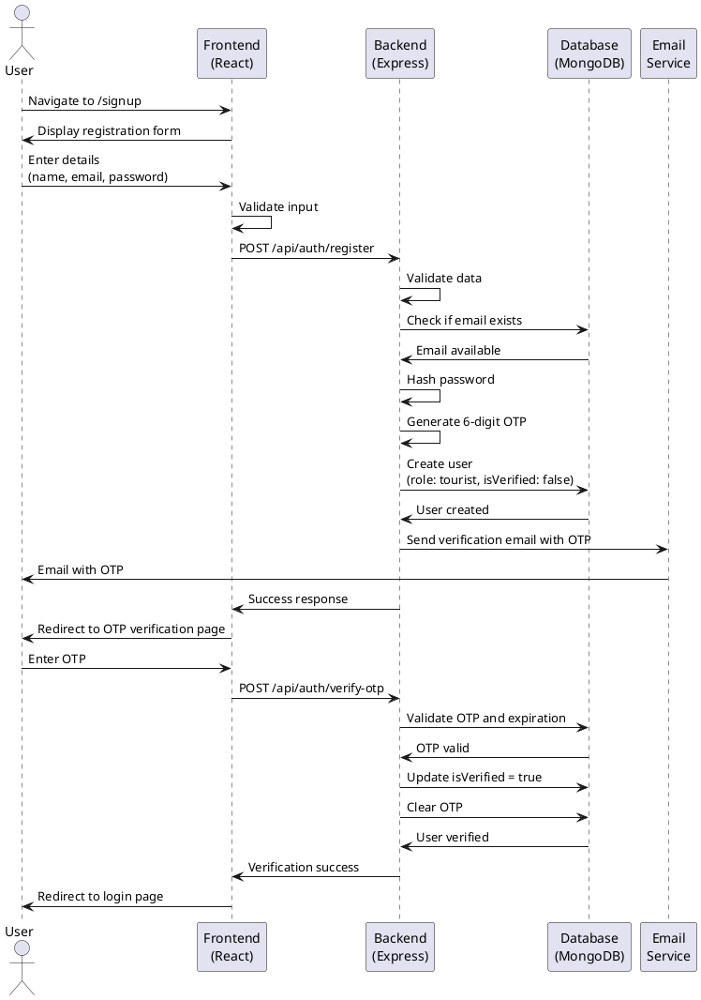
```plantuml
@startuml User_Registration
actor User
participant "Frontend\n(React)" as Frontend
participant "Backend\n(Express)" as Backend
participant "Database\n(MongoDB)" as DB
participant "Email\nService" as Email

User -> Frontend: Navigate to /signup
Frontend -> User: Display registration form

User -> Frontend: Enter details\n(name, email, password)
Frontend -> Frontend: Validate input

Frontend -> Backend: POST /api/auth/register
Backend -> Backend: Validate data
Backend -> DB: Check if email exists
DB -> Backend: Email available

Backend -> Backend: Hash password
Backend -> Backend: Generate 6-digit OTP
Backend -> DB: Create user\n(role: tourist, isVerified: false)
DB -> Backend: User created

Backend -> Email: Send verification email with OTP
Email -> User: Email with OTP

Backend -> Frontend: Success response
Frontend -> User: Redirect to OTP verification page

User -> Frontend: Enter OTP
Frontend -> Backend: POST /api/auth/verify-otp
Backend -> DB: Validate OTP and expiration
DB -> Backend: OTP valid

Backend -> DB: Update isVerified = true
Backend -> DB: Clear OTP
DB -> Backend: User verified

Backend -> Frontend: Verification success
Frontend -> User: Redirect to login page

@enduml
```

---

### 2. User Login with Email

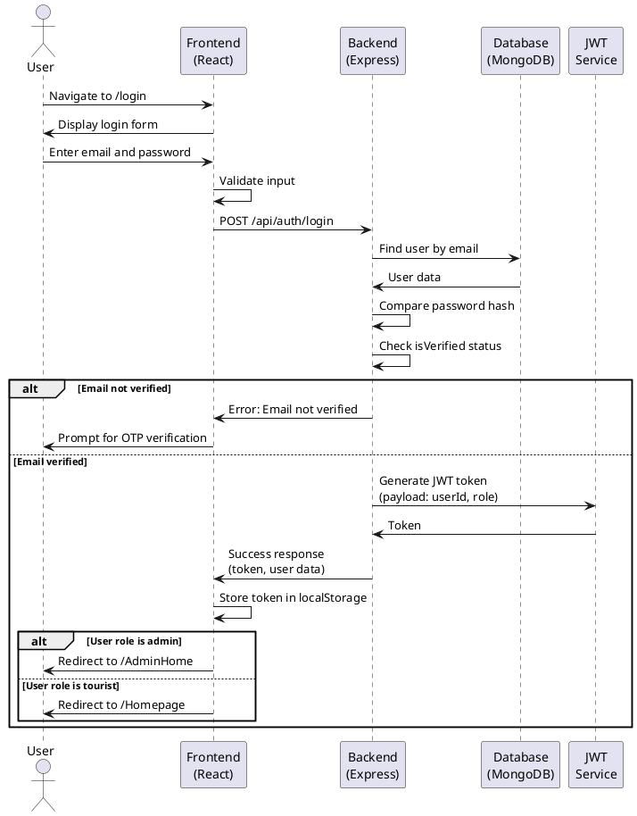
```plantuml
@startuml User_Login
actor User
participant "Frontend\n(React)" as Frontend
participant "Backend\n(Express)" as Backend
participant "Database\n(MongoDB)" as DB
participant "JWT\nService" as JWT

User -> Frontend: Navigate to /login
Frontend -> User: Display login form

User -> Frontend: Enter email and password
Frontend -> Frontend: Validate input

Frontend -> Backend: POST /api/auth/login
Backend -> DB: Find user by email
DB -> Backend: User data

Backend -> Backend: Compare password hash
Backend -> Backend: Check isVerified status

alt Email not verified
    Backend -> Frontend: Error: Email not verified
    Frontend -> User: Prompt for OTP verification
else Email verified
    Backend -> JWT: Generate JWT token\n(payload: userId, role)
    JWT -> Backend: Token
    
    Backend -> Frontend: Success response\n(token, user data)
    Frontend -> Frontend: Store token in localStorage
    
    alt User role is admin
        Frontend -> User: Redirect to /AdminHome
    else User role is tourist
        Frontend -> User: Redirect to /Homepage
    end
end

@enduml
```

---

### 3. Google OAuth Login

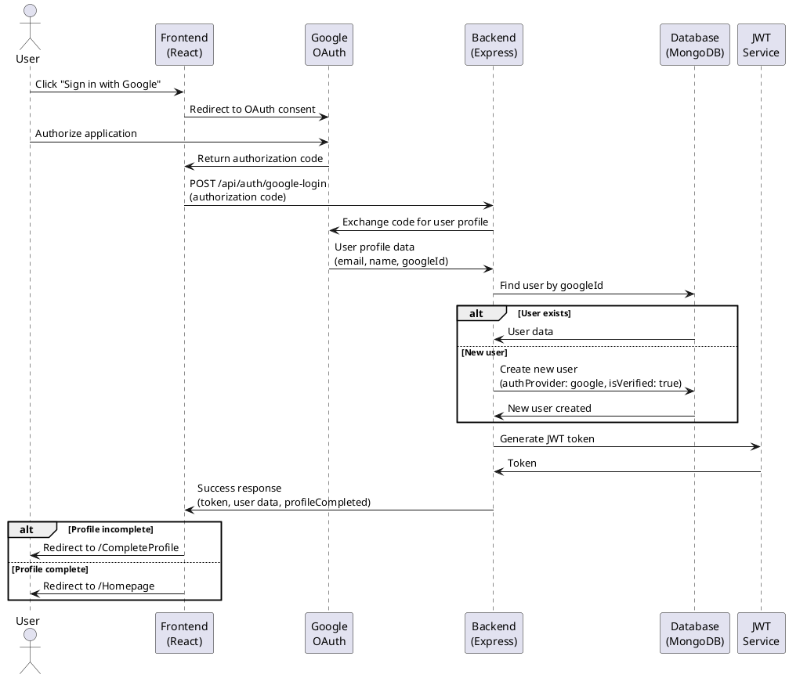
```plantuml
@startuml Google_OAuth_Login
actor User
participant "Frontend\n(React)" as Frontend
participant "Google\nOAuth" as Google
participant "Backend\n(Express)" as Backend
participant "Database\n(MongoDB)" as DB
participant "JWT\nService" as JWT

User -> Frontend: Click "Sign in with Google"
Frontend -> Google: Redirect to OAuth consent

User -> Google: Authorize application
Google -> Frontend: Return authorization code

Frontend -> Backend: POST /api/auth/google-login\n(authorization code)
Backend -> Google: Exchange code for user profile
Google -> Backend: User profile data\n(email, name, googleId)

Backend -> DB: Find user by googleId
alt User exists
    DB -> Backend: User data
else New user
    Backend -> DB: Create new user\n(authProvider: google, isVerified: true)
    DB -> Backend: New user created
end

Backend -> JWT: Generate JWT token
JWT -> Backend: Token

Backend -> Frontend: Success response\n(token, user data, profileCompleted)

alt Profile incomplete
    Frontend -> User: Redirect to /CompleteProfile
else Profile complete
    Frontend -> User: Redirect to /Homepage
end

@enduml
```

---

### 4. Password Reset

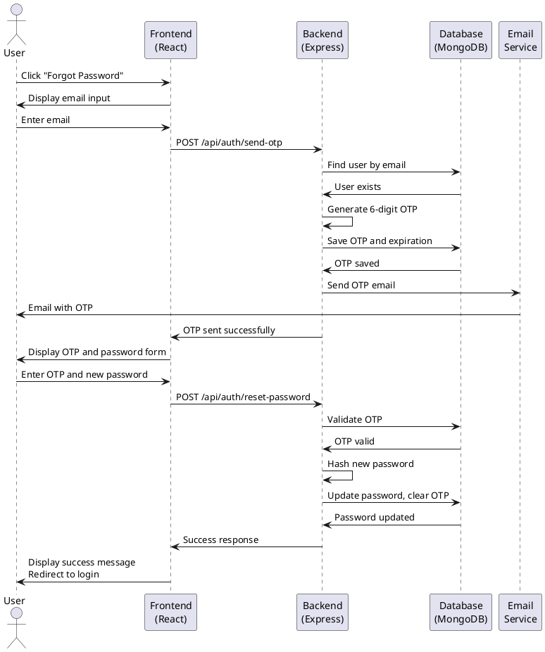
```plantuml
@startuml Password_Reset
actor User
participant "Frontend\n(React)" as Frontend
participant "Backend\n(Express)" as Backend
participant "Database\n(MongoDB)" as DB
participant "Email\nService" as Email

User -> Frontend: Click "Forgot Password"
Frontend -> User: Display email input

User -> Frontend: Enter email
Frontend -> Backend: POST /api/auth/send-otp

Backend -> DB: Find user by email
DB -> Backend: User exists

Backend -> Backend: Generate 6-digit OTP
Backend -> DB: Save OTP and expiration
DB -> Backend: OTP saved

Backend -> Email: Send OTP email
Email -> User: Email with OTP

Backend -> Frontend: OTP sent successfully
Frontend -> User: Display OTP and password form

User -> Frontend: Enter OTP and new password
Frontend -> Backend: POST /api/auth/reset-password

Backend -> DB: Validate OTP
DB -> Backend: OTP valid

Backend -> Backend: Hash new password
Backend -> DB: Update password, clear OTP
DB -> Backend: Password updated

Backend -> Frontend: Success response
Frontend -> User: Display success message\nRedirect to login

@enduml
```

---

## ITINERARY MANAGEMENT SEQUENCES

### 5. Create Custom Itinerary

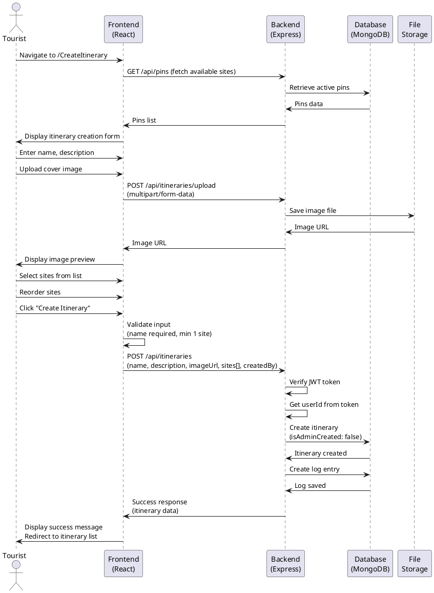
```plantuml
@startuml Create_Itinerary
actor Tourist
participant "Frontend\n(React)" as Frontend
participant "Backend\n(Express)" as Backend
participant "Database\n(MongoDB)" as DB
participant "File\nStorage" as Storage

Tourist -> Frontend: Navigate to /CreateItinerary
Frontend -> Backend: GET /api/pins (fetch available sites)
Backend -> DB: Retrieve active pins
DB -> Backend: Pins data
Backend -> Frontend: Pins list
Frontend -> Tourist: Display itinerary creation form

Tourist -> Frontend: Enter name, description
Tourist -> Frontend: Upload cover image

Frontend -> Backend: POST /api/itineraries/upload\n(multipart/form-data)
Backend -> Storage: Save image file
Storage -> Backend: Image URL
Backend -> Frontend: Image URL

Frontend -> Tourist: Display image preview

Tourist -> Frontend: Select sites from list
Tourist -> Frontend: Reorder sites
Tourist -> Frontend: Click "Create Itinerary"

Frontend -> Frontend: Validate input\n(name required, min 1 site)

Frontend -> Backend: POST /api/itineraries\n(name, description, imageUrl, sites[], createdBy)
Backend -> Backend: Verify JWT token
Backend -> Backend: Get userId from token

Backend -> DB: Create itinerary\n(isAdminCreated: false)
DB -> Backend: Itinerary created

Backend -> DB: Create log entry
DB -> Backend: Log saved

Backend -> Frontend: Success response\n(itinerary data)
Frontend -> Tourist: Display success message\nRedirect to itinerary list

@enduml
```

---

### 6. Start Tour and Mark Site as Visited

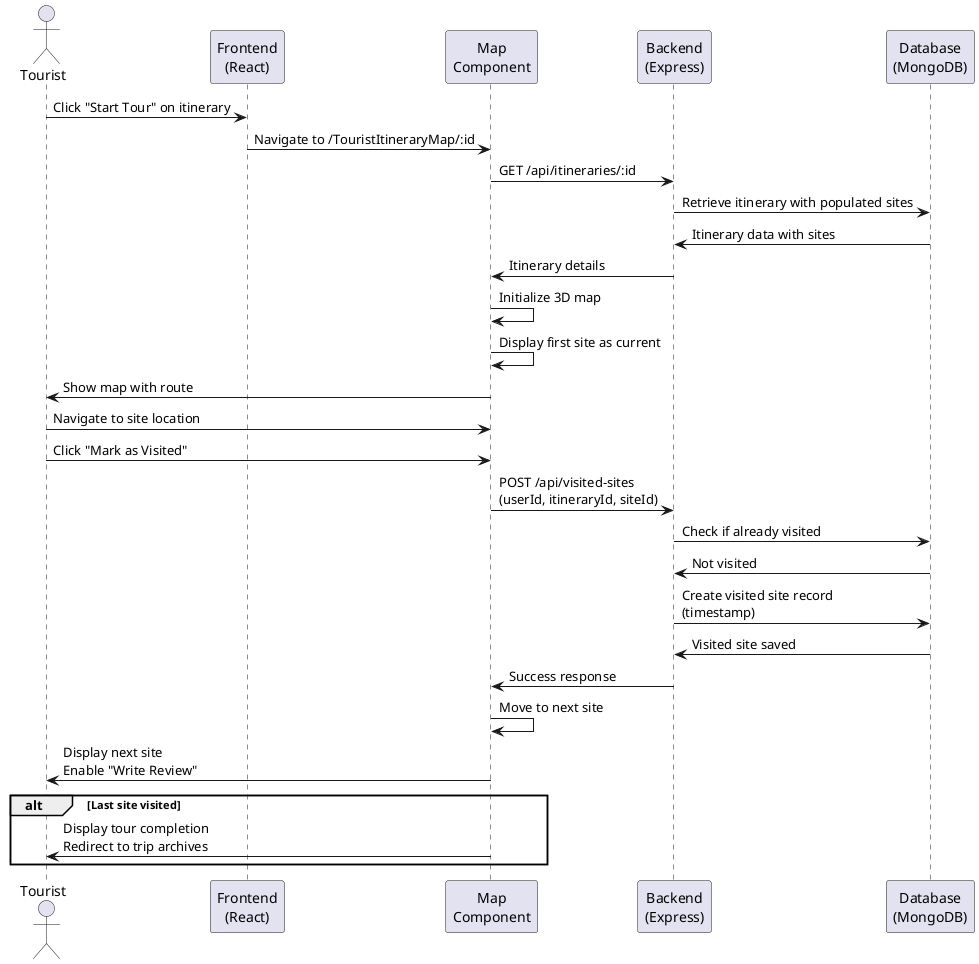
```plantuml
@startuml Start_Tour
actor Tourist
participant "Frontend\n(React)" as Frontend
participant "Map\nComponent" as Map
participant "Backend\n(Express)" as Backend
participant "Database\n(MongoDB)" as DB

Tourist -> Frontend: Click "Start Tour" on itinerary
Frontend -> Map: Navigate to /TouristItineraryMap/:id

Map -> Backend: GET /api/itineraries/:id
Backend -> DB: Retrieve itinerary with populated sites
DB -> Backend: Itinerary data with sites
Backend -> Map: Itinerary details

Map -> Map: Initialize 3D map
Map -> Map: Display first site as current
Map -> Tourist: Show map with route

Tourist -> Map: Navigate to site location
Tourist -> Map: Click "Mark as Visited"

Map -> Backend: POST /api/visited-sites\n(userId, itineraryId, siteId)
Backend -> DB: Check if already visited
DB -> Backend: Not visited

Backend -> DB: Create visited site record\n(timestamp)
DB -> Backend: Visited site saved

Backend -> Map: Success response

Map -> Map: Move to next site
Map -> Tourist: Display next site\nEnable "Write Review"

alt Last site visited
    Map -> Tourist: Display tour completion\nRedirect to trip archives
end

@enduml
```

---

### 7. Browse and View Itinerary Details

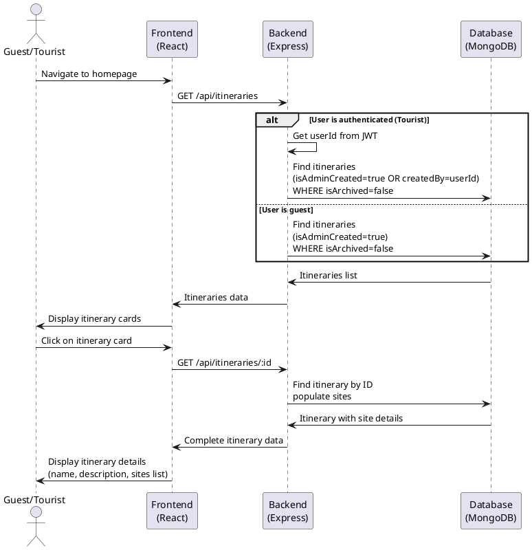
```plantuml
@startuml Browse_Itineraries
actor User as "Guest/Tourist"
participant "Frontend\n(React)" as Frontend
participant "Backend\n(Express)" as Backend
participant "Database\n(MongoDB)" as DB

User -> Frontend: Navigate to homepage
Frontend -> Backend: GET /api/itineraries

alt User is authenticated (Tourist)
    Backend -> Backend: Get userId from JWT
    Backend -> DB: Find itineraries\n(isAdminCreated=true OR createdBy=userId)\nWHERE isArchived=false
else User is guest
    Backend -> DB: Find itineraries\n(isAdminCreated=true)\nWHERE isArchived=false
end

DB -> Backend: Itineraries list
Backend -> Frontend: Itineraries data

Frontend -> User: Display itinerary cards

User -> Frontend: Click on itinerary card
Frontend -> Backend: GET /api/itineraries/:id

Backend -> DB: Find itinerary by ID\npopulate sites
DB -> Backend: Itinerary with site details

Backend -> Frontend: Complete itinerary data
Frontend -> User: Display itinerary details\n(name, description, sites list)

@enduml
```

---

## REVIEW SYSTEM SEQUENCES

### 8. Write Review with Photos

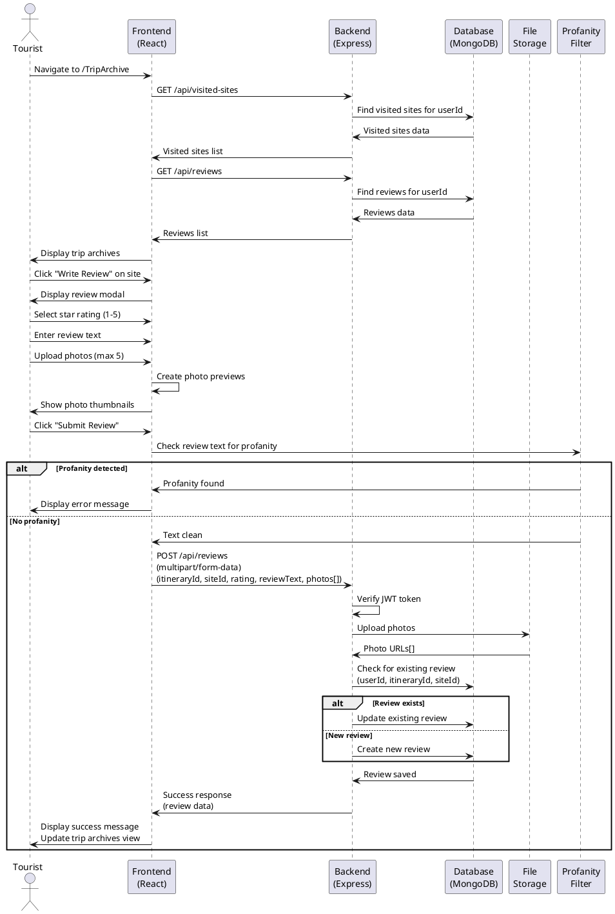
```plantuml
@startuml Write_Review
actor Tourist
participant "Frontend\n(React)" as Frontend
participant "Backend\n(Express)" as Backend
participant "Database\n(MongoDB)" as DB
participant "File\nStorage" as Storage
participant "Profanity\nFilter" as Filter

Tourist -> Frontend: Navigate to /TripArchive
Frontend -> Backend: GET /api/visited-sites
Backend -> DB: Find visited sites for userId
DB -> Backend: Visited sites data
Backend -> Frontend: Visited sites list

Frontend -> Backend: GET /api/reviews
Backend -> DB: Find reviews for userId
DB -> Backend: Reviews data
Backend -> Frontend: Reviews list

Frontend -> Tourist: Display trip archives

Tourist -> Frontend: Click "Write Review" on site
Frontend -> Tourist: Display review modal

Tourist -> Frontend: Select star rating (1-5)
Tourist -> Frontend: Enter review text
Tourist -> Frontend: Upload photos (max 5)

Frontend -> Frontend: Create photo previews
Frontend -> Tourist: Show photo thumbnails

Tourist -> Frontend: Click "Submit Review"

Frontend -> Filter: Check review text for profanity
alt Profanity detected
    Filter -> Frontend: Profanity found
    Frontend -> Tourist: Display error message
else No profanity
    Filter -> Frontend: Text clean
    
    Frontend -> Backend: POST /api/reviews\n(multipart/form-data)\n(itineraryId, siteId, rating, reviewText, photos[])
    Backend -> Backend: Verify JWT token
    
    Backend -> Storage: Upload photos
    Storage -> Backend: Photo URLs[]
    
    Backend -> DB: Check for existing review\n(userId, itineraryId, siteId)
    
    alt Review exists
        Backend -> DB: Update existing review
    else New review
        Backend -> DB: Create new review
    end
    
    DB -> Backend: Review saved
    
    Backend -> Frontend: Success response\n(review data)
    Frontend -> Tourist: Display success message\nUpdate trip archives view
end

@enduml
```

---

### 9. Edit and Delete Review

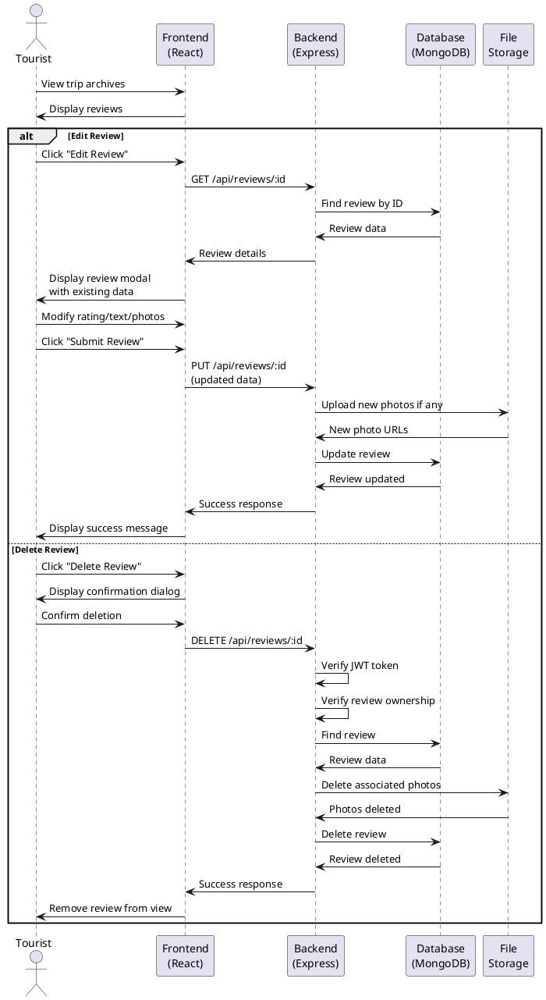
```plantuml
@startuml Edit_Delete_Review
actor Tourist
participant "Frontend\n(React)" as Frontend
participant "Backend\n(Express)" as Backend
participant "Database\n(MongoDB)" as DB
participant "File\nStorage" as Storage

Tourist -> Frontend: View trip archives
Frontend -> Tourist: Display reviews

alt Edit Review
    Tourist -> Frontend: Click "Edit Review"
    Frontend -> Backend: GET /api/reviews/:id
    Backend -> DB: Find review by ID
    DB -> Backend: Review data
    Backend -> Frontend: Review details
    
    Frontend -> Tourist: Display review modal\nwith existing data
    
    Tourist -> Frontend: Modify rating/text/photos
    Tourist -> Frontend: Click "Submit Review"
    
    Frontend -> Backend: PUT /api/reviews/:id\n(updated data)
    Backend -> Storage: Upload new photos if any
    Storage -> Backend: New photo URLs
    
    Backend -> DB: Update review
    DB -> Backend: Review updated
    
    Backend -> Frontend: Success response
    Frontend -> Tourist: Display success message
    
else Delete Review
    Tourist -> Frontend: Click "Delete Review"
    Frontend -> Tourist: Display confirmation dialog
    
    Tourist -> Frontend: Confirm deletion
    
    Frontend -> Backend: DELETE /api/reviews/:id
    Backend -> Backend: Verify JWT token
    Backend -> Backend: Verify review ownership
    
    Backend -> DB: Find review
    DB -> Backend: Review data
    
    Backend -> Storage: Delete associated photos
    Storage -> Backend: Photos deleted
    
    Backend -> DB: Delete review
    DB -> Backend: Review deleted
    
    Backend -> Frontend: Success response
    Frontend -> Tourist: Remove review from view
end

@enduml
```

---

## ADMIN MANAGEMENT SEQUENCES

### 10. Admin - Add New Site

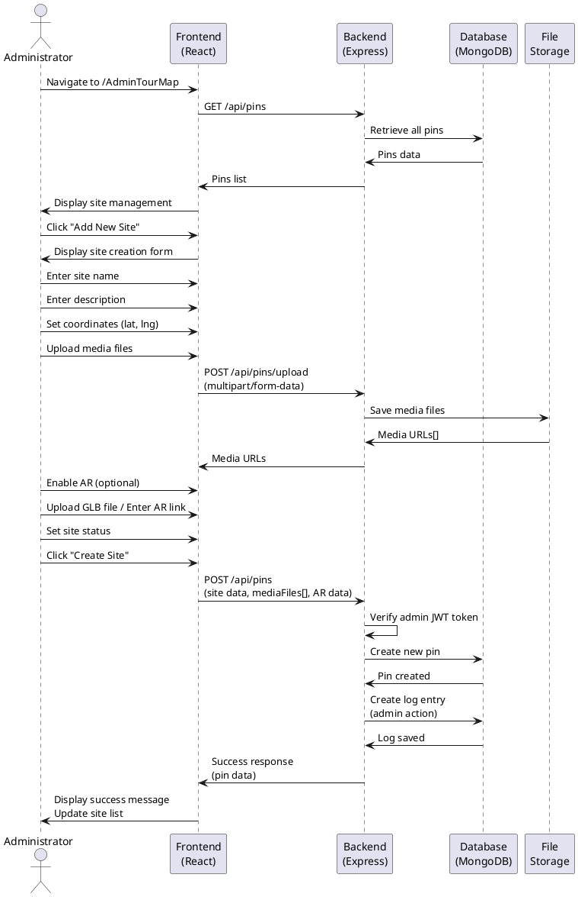
```plantuml
@startuml Admin_Add_Site
actor Administrator
participant "Frontend\n(React)" as Frontend
participant "Backend\n(Express)" as Backend
participant "Database\n(MongoDB)" as DB
participant "File\nStorage" as Storage

Administrator -> Frontend: Navigate to /AdminTourMap
Frontend -> Backend: GET /api/pins
Backend -> DB: Retrieve all pins
DB -> Backend: Pins data
Backend -> Frontend: Pins list
Frontend -> Administrator: Display site management

Administrator -> Frontend: Click "Add New Site"
Frontend -> Administrator: Display site creation form

Administrator -> Frontend: Enter site name
Administrator -> Frontend: Enter description
Administrator -> Frontend: Set coordinates (lat, lng)
Administrator -> Frontend: Upload media files

Frontend -> Backend: POST /api/pins/upload\n(multipart/form-data)
Backend -> Storage: Save media files
Storage -> Backend: Media URLs[]
Backend -> Frontend: Media URLs

Administrator -> Frontend: Enable AR (optional)
Administrator -> Frontend: Upload GLB file / Enter AR link
Administrator -> Frontend: Set site status

Administrator -> Frontend: Click "Create Site"

Frontend -> Backend: POST /api/pins\n(site data, mediaFiles[], AR data)
Backend -> Backend: Verify admin JWT token

Backend -> DB: Create new pin
DB -> Backend: Pin created

Backend -> DB: Create log entry\n(admin action)
DB -> Backend: Log saved

Backend -> Frontend: Success response\n(pin data)
Frontend -> Administrator: Display success message\nUpdate site list

@enduml
```

---

### 11. Admin - Manage User Roles

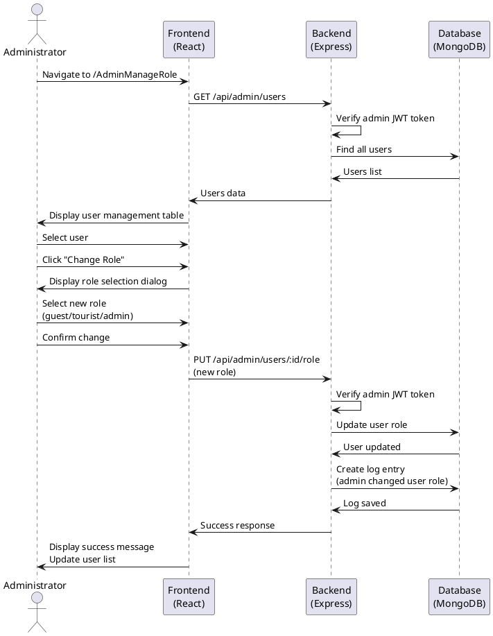
```plantuml
@startuml Admin_Manage_Users
actor Administrator
participant "Frontend\n(React)" as Frontend
participant "Backend\n(Express)" as Backend
participant "Database\n(MongoDB)" as DB

Administrator -> Frontend: Navigate to /AdminManageRole
Frontend -> Backend: GET /api/admin/users
Backend -> Backend: Verify admin JWT token

Backend -> DB: Find all users
DB -> Backend: Users list
Backend -> Frontend: Users data

Frontend -> Administrator: Display user management table

Administrator -> Frontend: Select user
Administrator -> Frontend: Click "Change Role"
Frontend -> Administrator: Display role selection dialog

Administrator -> Frontend: Select new role\n(guest/tourist/admin)
Administrator -> Frontend: Confirm change

Frontend -> Backend: PUT /api/admin/users/:id/role\n(new role)
Backend -> Backend: Verify admin JWT token

Backend -> DB: Update user role
DB -> Backend: User updated

Backend -> DB: Create log entry\n(admin changed user role)
DB -> Backend: Log saved

Backend -> Frontend: Success response
Frontend -> Administrator: Display success message\nUpdate user list

@enduml
```

---

### 12. Admin - Manage Photobooth Filters

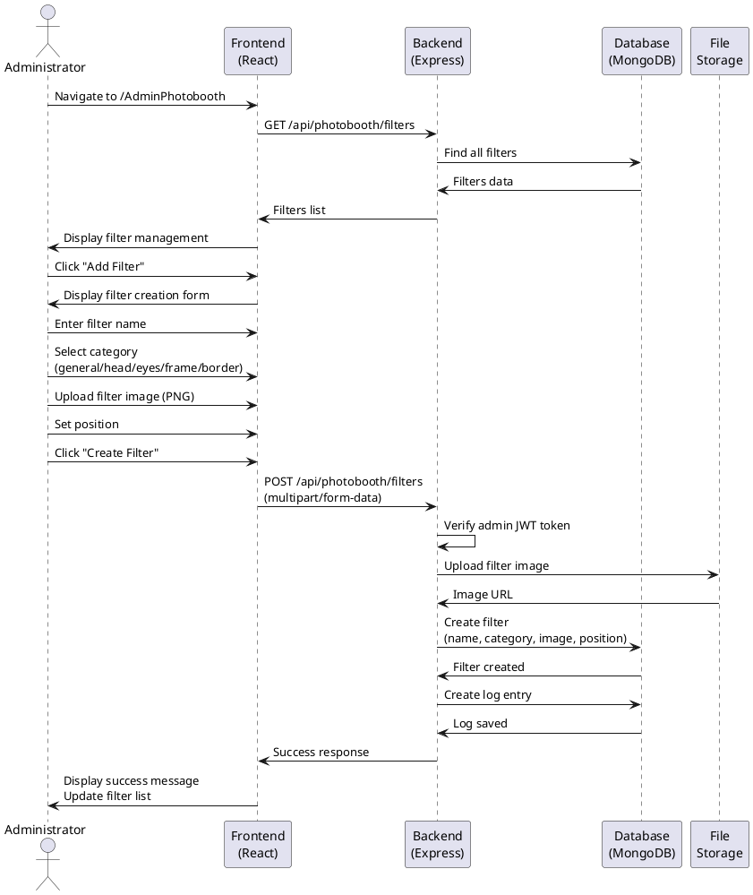
```plantuml
@startuml Admin_Manage_Filters
actor Administrator
participant "Frontend\n(React)" as Frontend
participant "Backend\n(Express)" as Backend
participant "Database\n(MongoDB)" as DB
participant "File\nStorage" as Storage

Administrator -> Frontend: Navigate to /AdminPhotobooth
Frontend -> Backend: GET /api/photobooth/filters
Backend -> DB: Find all filters
DB -> Backend: Filters data
Backend -> Frontend: Filters list
Frontend -> Administrator: Display filter management

Administrator -> Frontend: Click "Add Filter"
Frontend -> Administrator: Display filter creation form

Administrator -> Frontend: Enter filter name
Administrator -> Frontend: Select category\n(general/head/eyes/frame/border)
Administrator -> Frontend: Upload filter image (PNG)
Administrator -> Frontend: Set position

Administrator -> Frontend: Click "Create Filter"

Frontend -> Backend: POST /api/photobooth/filters\n(multipart/form-data)
Backend -> Backend: Verify admin JWT token

Backend -> Storage: Upload filter image
Storage -> Backend: Image URL

Backend -> DB: Create filter\n(name, category, image, position)
DB -> Backend: Filter created

Backend -> DB: Create log entry
DB -> Backend: Log saved

Backend -> Frontend: Success response
Frontend -> Administrator: Display success message\nUpdate filter list

@enduml
```

---

### 13. Admin - Manage Chatbot Knowledge

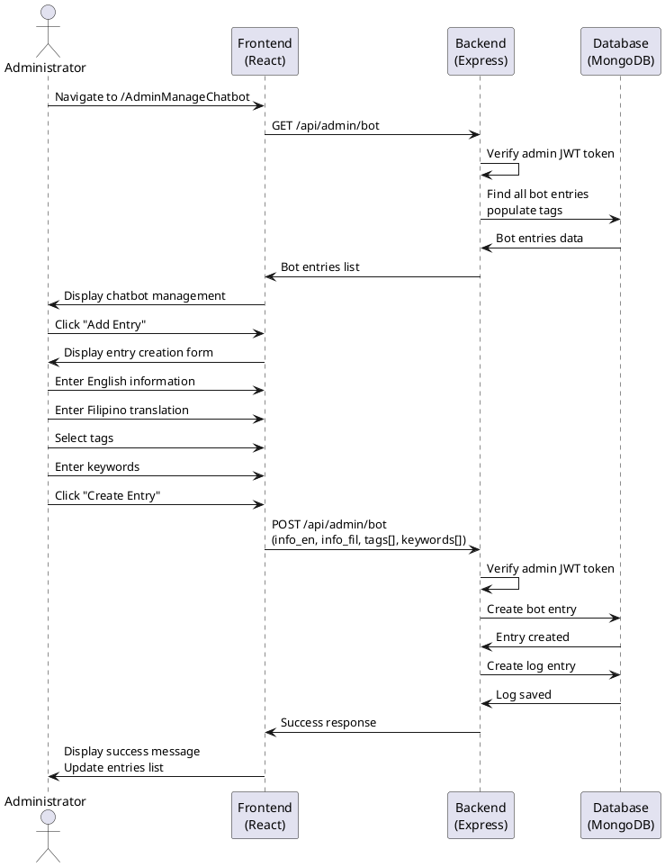
```plantuml
@startuml Admin_Manage_Chatbot
actor Administrator
participant "Frontend\n(React)" as Frontend
participant "Backend\n(Express)" as Backend
participant "Database\n(MongoDB)" as DB

Administrator -> Frontend: Navigate to /AdminManageChatbot
Frontend -> Backend: GET /api/admin/bot
Backend -> Backend: Verify admin JWT token

Backend -> DB: Find all bot entries\npopulate tags
DB -> Backend: Bot entries data
Backend -> Frontend: Bot entries list

Frontend -> Administrator: Display chatbot management

Administrator -> Frontend: Click "Add Entry"
Frontend -> Administrator: Display entry creation form

Administrator -> Frontend: Enter English information
Administrator -> Frontend: Enter Filipino translation
Administrator -> Frontend: Select tags
Administrator -> Frontend: Enter keywords

Administrator -> Frontend: Click "Create Entry"

Frontend -> Backend: POST /api/admin/bot\n(info_en, info_fil, tags[], keywords[])
Backend -> Backend: Verify admin JWT token

Backend -> DB: Create bot entry
DB -> Backend: Entry created

Backend -> DB: Create log entry
DB -> Backend: Log saved

Backend -> Frontend: Success response
Frontend -> Administrator: Display success message\nUpdate entries list

@enduml
```

---

### 14. Admin - View System Logs

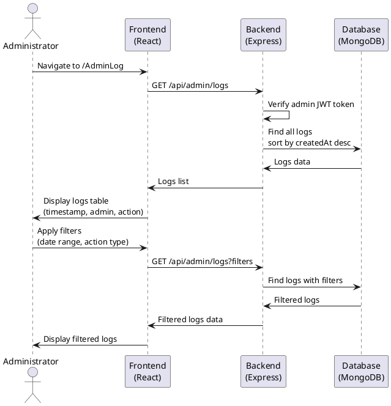
```plantuml
@startuml Admin_View_Logs
actor Administrator
participant "Frontend\n(React)" as Frontend
participant "Backend\n(Express)" as Backend
participant "Database\n(MongoDB)" as DB

Administrator -> Frontend: Navigate to /AdminLog
Frontend -> Backend: GET /api/admin/logs
Backend -> Backend: Verify admin JWT token

Backend -> DB: Find all logs\nsort by createdAt desc
DB -> Backend: Logs data
Backend -> Frontend: Logs list

Frontend -> Administrator: Display logs table\n(timestamp, admin, action)

Administrator -> Frontend: Apply filters\n(date range, action type)
Frontend -> Backend: GET /api/admin/logs?filters

Backend -> DB: Find logs with filters
DB -> Backend: Filtered logs
Backend -> Frontend: Filtered logs data

Frontend -> Administrator: Display filtered logs

@enduml
```

---

### 15. Tourist - Use Photobooth

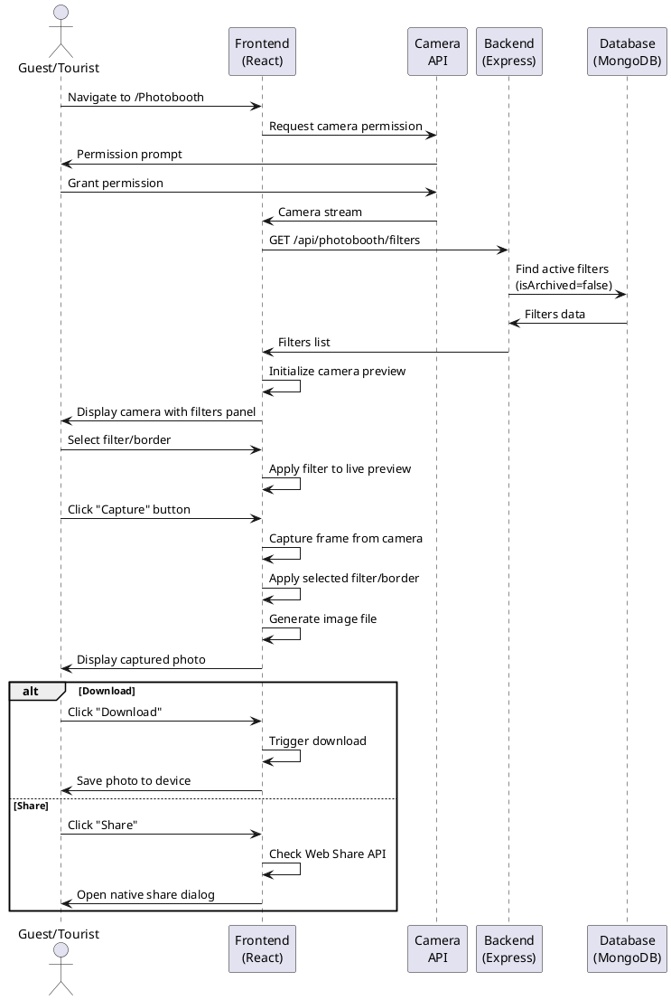
```plantuml
@startuml Use_Photobooth
actor User as "Guest/Tourist"
participant "Frontend\n(React)" as Frontend
participant "Camera\nAPI" as Camera
participant "Backend\n(Express)" as Backend
participant "Database\n(MongoDB)" as DB

User -> Frontend: Navigate to /Photobooth
Frontend -> Camera: Request camera permission
Camera -> User: Permission prompt

User -> Camera: Grant permission
Camera -> Frontend: Camera stream

Frontend -> Backend: GET /api/photobooth/filters
Backend -> DB: Find active filters\n(isArchived=false)
DB -> Backend: Filters data
Backend -> Frontend: Filters list

Frontend -> Frontend: Initialize camera preview
Frontend -> User: Display camera with filters panel

User -> Frontend: Select filter/border
Frontend -> Frontend: Apply filter to live preview

User -> Frontend: Click "Capture" button
Frontend -> Frontend: Capture frame from camera
Frontend -> Frontend: Apply selected filter/border
Frontend -> Frontend: Generate image file

Frontend -> User: Display captured photo

alt Download
    User -> Frontend: Click "Download"
    Frontend -> Frontend: Trigger download
    Frontend -> User: Save photo to device
else Share
    User -> Frontend: Click "Share"
    Frontend -> Frontend: Check Web Share API
    Frontend -> User: Open native share dialog
end

@enduml
```

---

### 16. User - Interact with AI Chatbot

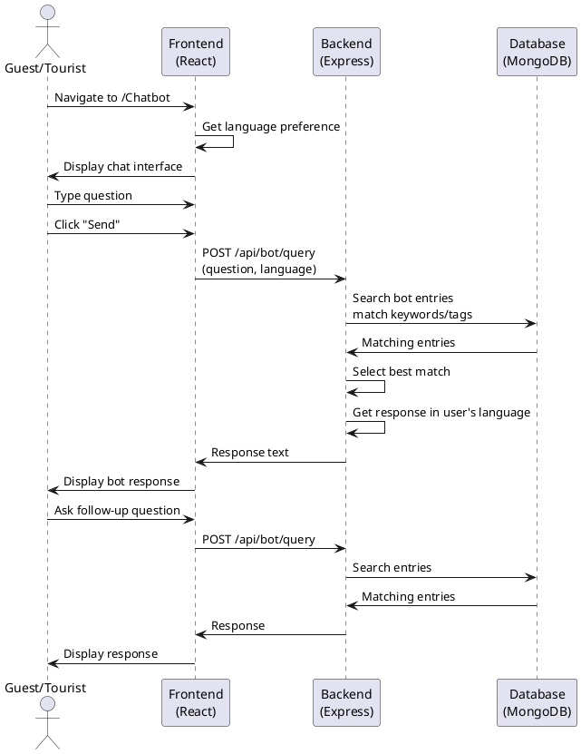
```plantuml
@startuml Use_Chatbot
actor User as "Guest/Tourist"
participant "Frontend\n(React)" as Frontend
participant "Backend\n(Express)" as Backend
participant "Database\n(MongoDB)" as DB

User -> Frontend: Navigate to /Chatbot
Frontend -> Frontend: Get language preference
Frontend -> User: Display chat interface

User -> Frontend: Type question
User -> Frontend: Click "Send"

Frontend -> Backend: POST /api/bot/query\n(question, language)

Backend -> DB: Search bot entries\nmatch keywords/tags
DB -> Backend: Matching entries

Backend -> Backend: Select best match
Backend -> Backend: Get response in user's language

Backend -> Frontend: Response text
Frontend -> User: Display bot response

User -> Frontend: Ask follow-up question
Frontend -> Backend: POST /api/bot/query

Backend -> DB: Search entries
DB -> Backend: Matching entries
Backend -> Frontend: Response

Frontend -> User: Display response

@enduml
```

---

## Summary

This document contains 16 comprehensive sequence diagrams covering:

1. **Authentication**: Registration, Login (Email & Google OAuth), Password Reset
2. **Itinerary Management**: Create, Browse, Start Tour, Mark Visited
3. **Review System**: Write, Edit, Delete Reviews
4. **Admin Functions**: Site Management, User Management, Filter Management, Chatbot Management, Logs
5. **User Features**: Photobooth, Chatbot

Each diagram shows the complete interaction flow between actors, frontend, backend, database, and external services.

