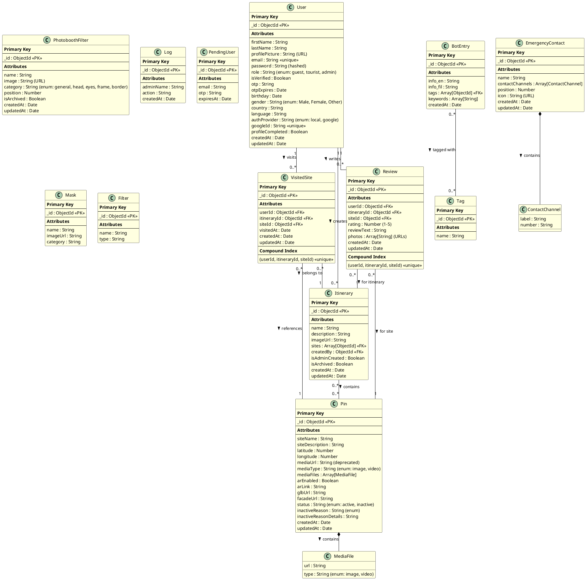

# Intramuros Tourism System - Database Diagram

## Database Overview
The system uses **MongoDB** as the database management system. MongoDB is a NoSQL document-oriented database that stores data in flexible, JSON-like documents.

**Database Name**: `intramuros_tourism_db`  
**Total Collections**: 13

---

## Entity Relationship Diagram (ERD)

---

## Collection Details

### 1. User Collection
**Purpose**: Stores all user accounts (guests, tourists, admins)

| Field | Type | Description | Constraints |
|-------|------|-------------|-------------|
| _id | ObjectId | Primary key | Auto-generated |
| firstName | String | User's first name | Required |
| lastName | String | User's last name | Required |
| profilePicture | String | URL to profile image | Optional |
| email | String | User's email address | Required, Unique |
| password | String | Hashed password | Required for local auth |
| role | String | User role | Enum: guest, tourist, admin |
| isVerified | Boolean | Email verification status | Default: false |
| otp | String | One-time password | 6 digits |
| otpExpires | Date | OTP expiration time | 10 minutes |
| birthday | Date | User's birth date | Optional |
| gender | String | User's gender | Enum: Male, Female, Other |
| country | String | User's country | Optional |
| language | String | Preferred language | Optional |
| authProvider | String | Authentication method | Enum: local, google |
| googleId | String | Google OAuth ID | Unique, Sparse |
| profileCompleted | Boolean | Profile completion status | Default: false |

**Indexes**:
- `email`: Unique index
- `googleId`: Unique sparse index

---

### 2. Pin Collection (Sites)
**Purpose**: Stores tourist site/location information

| Field | Type | Description | Constraints |
|-------|------|-------------|-------------|
| _id | ObjectId | Primary key | Auto-generated |
| siteName | String | Name of the site | Required |
| siteDescription | String | Detailed description | Optional |
| latitude | Number | GPS latitude | Required |
| longitude | Number | GPS longitude | Required |
| mediaUrl | String | Legacy media URL | Deprecated |
| mediaType | String | Type of media | Enum: image, video |
| mediaFiles | Array | Array of media objects | Optional |
| arEnabled | Boolean | AR feature enabled | Default: false |
| arLink | String | AR content link | Optional |
| glbUrl | String | 3D model URL | Optional |
| facadeUrl | String | Building facade image | Optional |
| status | String | Site availability | Enum: active, inactive |
| inactiveReason | String | Reason for inactive status | Enum values |
| inactiveReasonDetails | String | Additional details | Optional |

**MediaFile Schema**:
- `url`: String (required)
- `type`: String (enum: image, video)

---

### 3. Itinerary Collection
**Purpose**: Stores tour itineraries (admin and user-created)

| Field | Type | Description | Constraints |
|-------|------|-------------|-------------|
| _id | ObjectId | Primary key | Auto-generated |
| name | String | Itinerary name | Required |
| description | String | Itinerary description | Optional |
| imageUrl | String | Cover image URL | Optional |
| sites | Array[ObjectId] | Array of Pin IDs | References Pin |
| createdBy | ObjectId | Creator user ID | Required, References User |
| isAdminCreated | Boolean | Created by admin | Default: false |
| isArchived | Boolean | Archive status | Default: false |

**Relationships**:
- `sites`: References multiple Pin documents
- `createdBy`: References User document

---

### 4. VisitedSite Collection
**Purpose**: Tracks sites visited by tourists

| Field | Type | Description | Constraints |
|-------|------|-------------|-------------|
| _id | ObjectId | Primary key | Auto-generated |
| userId | ObjectId | Tourist ID | Required, References User |
| itineraryId | ObjectId | Itinerary ID | Required, References Itinerary |
| siteId | ObjectId | Site ID | Required, References Pin |
| visitedAt | Date | Visit timestamp | Default: Date.now |

**Indexes**:
- Compound unique index: `(userId, itineraryId, siteId)`

**Purpose of Compound Index**: Prevents duplicate visit records for same user, itinerary, and site combination

---

### 5. Review Collection
**Purpose**: Stores user reviews and ratings for sites

| Field | Type | Description | Constraints |
|-------|------|-------------|-------------|
| _id | ObjectId | Primary key | Auto-generated |
| userId | ObjectId | Reviewer ID | Required, References User |
| itineraryId | ObjectId | Itinerary ID | Required, References Itinerary |
| siteId | ObjectId | Site ID | Required, References Pin |
| rating | Number | Star rating | Required, Min: 1, Max: 5 |
| reviewText | String | Review content | Optional |
| photos | Array[String] | Photo URLs | Max 5 photos |

**Indexes**:
- Compound unique index: `(userId, itineraryId, siteId)`

**Purpose of Compound Index**: Ensures one review per user per site per itinerary

---

### 6. PhotoboothFilter Collection
**Purpose**: Stores photobooth filters and borders

| Field | Type | Description | Constraints |
|-------|------|-------------|-------------|
| _id | ObjectId | Primary key | Auto-generated |
| name | String | Filter name | Required |
| image | String | Filter image URL | Required |
| category | String | Filter category | Enum: general, head, eyes, frame, border |
| position | Number | Display order | Default: 0 |
| isArchived | Boolean | Archive status | Default: false |

---

### 7. BotEntry Collection
**Purpose**: Stores AI chatbot knowledge base

| Field | Type | Description | Constraints |
|-------|------|-------------|-------------|
| _id | ObjectId | Primary key | Auto-generated |
| info_en | String | Information in English | Required |
| info_fil | String | Information in Filipino | Optional |
| tags | Array[ObjectId] | Associated tags | References Tag |
| keywords | Array[String] | Search keywords | Optional |
| createdAt | Date | Creation timestamp | Auto-generated |

**Relationships**:
- `tags`: References multiple Tag documents

---

### 8. Tag Collection
**Purpose**: Stores tags for categorizing bot entries

| Field | Type | Description | Constraints |
|-------|------|-------------|-------------|
| _id | ObjectId | Primary key | Auto-generated |
| name | String | Tag name | Required |

---

### 9. EmergencyContact Collection
**Purpose**: Stores emergency contact information

| Field | Type | Description | Constraints |
|-------|------|-------------|-------------|
| _id | ObjectId | Primary key | Auto-generated |
| name | String | Contact name | Required |
| contactChannels | Array | Contact methods | Array of ContactChannel |
| position | Number | Display order | Default: 0 |
| icon | String | Icon image URL | Optional |

**ContactChannel Schema**:
- `label`: String (e.g., "Hotline", "Mobile")
- `number`: String (phone number)

---

### 10. Log Collection
**Purpose**: Stores admin activity logs

| Field | Type | Description | Constraints |
|-------|------|-------------|-------------|
| _id | ObjectId | Primary key | Auto-generated |
| adminName | String | Admin who performed action | Required |
| action | String | Action description | Required |
| createdAt | Date | Action timestamp | Auto-generated |

---

### 11. PendingUser Collection
**Purpose**: Temporary storage for unverified registrations

| Field | Type | Description | Constraints |
|-------|------|-------------|-------------|
| _id | ObjectId | Primary key | Auto-generated |
| email | String | User email | Required |
| otp | String | Verification OTP | Required |
| expiresAt | Date | Expiration time | Required |

---

### 12. Mask Collection
**Purpose**: Stores face mask overlays (legacy/deprecated)

| Field | Type | Description | Constraints |
|-------|------|-------------|-------------|
| _id | ObjectId | Primary key | Auto-generated |
| name | String | Mask name | Required |
| imageUrl | String | Mask image URL | Required |
| category | String | Mask category | Optional |

---

### 13. Filter Collection
**Purpose**: Stores photo filters (legacy/deprecated)

| Field | Type | Description | Constraints |
|-------|------|-------------|-------------|
| _id | ObjectId | Primary key | Auto-generated |
| name | String | Filter name | Required |
| type | String | Filter type | Optional |

---

## Database Relationships Summary

### One-to-Many Relationships

1. **User → Itinerary** (1:N)
   - One user can create multiple itineraries
   - Field: `Itinerary.createdBy` references `User._id`

2. **User → VisitedSite** (1:N)
   - One user can visit multiple sites
   - Field: `VisitedSite.userId` references `User._id`

3. **User → Review** (1:N)
   - One user can write multiple reviews
   - Field: `Review.userId` references `User._id`

4. **Itinerary → VisitedSite** (1:N)
   - One itinerary can have multiple visited sites
   - Field: `VisitedSite.itineraryId` references `Itinerary._id`

5. **Pin → VisitedSite** (1:N)
   - One site can be visited multiple times
   - Field: `VisitedSite.siteId` references `Pin._id`

6. **Itinerary → Review** (1:N)
   - One itinerary can have multiple reviews
   - Field: `Review.itineraryId` references `Itinerary._id`

7. **Pin → Review** (1:N)
   - One site can have multiple reviews
   - Field: `Review.siteId` references `Pin._id`

### Many-to-Many Relationships

1. **Itinerary ↔ Pin** (M:N)
   - One itinerary contains multiple sites
   - One site can be in multiple itineraries
   - Field: `Itinerary.sites` array of `Pin._id`

2. **BotEntry ↔ Tag** (M:N)
   - One bot entry can have multiple tags
   - One tag can be used in multiple entries
   - Field: `BotEntry.tags` array of `Tag._id`

### Embedded Documents

1. **Pin → MediaFile** (1:N embedded)
   - Media files embedded within Pin document
   - Field: `Pin.mediaFiles` array

2. **EmergencyContact → ContactChannel** (1:N embedded)
   - Contact channels embedded within EmergencyContact
   - Field: `EmergencyContact.contactChannels` array

---

## Indexes and Performance Optimization

### Unique Indexes
1. `User.email` - Ensures unique email addresses
2. `User.googleId` - Ensures unique Google OAuth IDs (sparse)
3. `(VisitedSite.userId, itineraryId, siteId)` - Prevents duplicate visits
4. `(Review.userId, itineraryId, siteId)` - Ensures one review per site visit

### Regular Indexes
- Timestamps (`createdAt`, `updatedAt`) for sorting
- Foreign key fields for efficient joins/lookups

### Query Optimization Strategies
1. **Population**: Use `.populate()` for referenced documents
2. **Projection**: Select only needed fields
3. **Pagination**: Limit results for large collections
4. **Caching**: Cache frequently accessed data (itineraries, pins)

---

## Data Integrity Rules

1. **Referential Integrity**:
   - Foreign keys validated before document creation
   - Cascade delete for dependent documents (e.g., user deletion removes their itineraries)

2. **Validation Rules**:
   - Email format validation
   - Password minimum length (6 characters)
   - Rating range (1-5)
   - Enum values strictly enforced

3. **Business Rules**:
   - Users must verify email before full access
   - Only itinerary creators can edit/delete their itineraries
   - Admins can manage all content
   - Reviews require prior site visit

---

## Database Size Estimates

Based on typical usage patterns:

| Collection | Estimated Documents | Avg Size | Total Size |
|------------|---------------------|----------|------------|
| User | 10,000 | 1 KB | 10 MB |
| Pin | 100 | 5 KB | 500 KB |
| Itinerary | 500 | 2 KB | 1 MB |
| VisitedSite | 50,000 | 0.5 KB | 25 MB |
| Review | 30,000 | 2 KB | 60 MB |
| PhotoboothFilter | 50 | 1 KB | 50 KB |
| BotEntry | 200 | 2 KB | 400 KB |
| EmergencyContact | 20 | 1 KB | 20 KB |
| Log | 100,000 | 0.5 KB | 50 MB |

**Total Estimated Database Size**: ~150 MB (excluding media files)

**Note**: Media files (images, videos) are stored in file system, only URLs stored in database.

